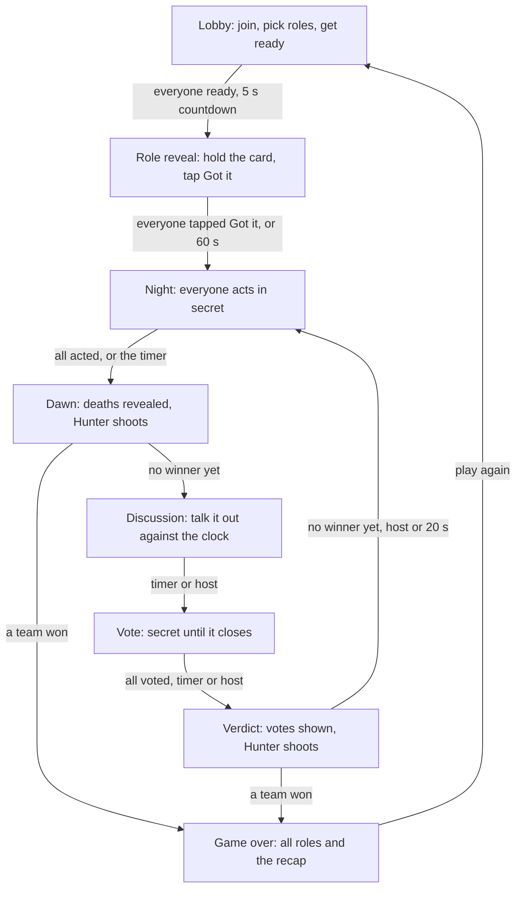
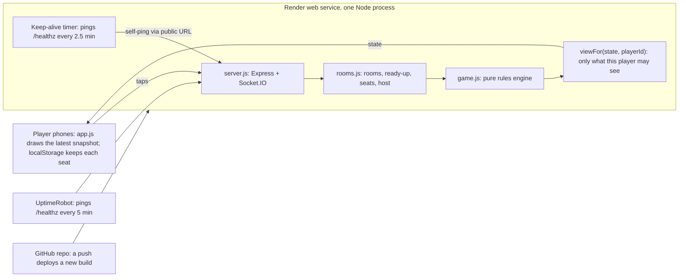

# Werewolf Online: Game Design & Build Plan

> Exported from the living plan doc (https://claude.ai/code/artifact/cfa4e30b-4581-440b-b77a-5c05536a7451). If the two disagree, the doc wins.

Oct 1, 2026 · @Abhijit Mishra

## Overview

Build a free, browser-based Werewolf game for 5 to 20 friends, each on their own phone, run by one Node.js service on Render. One player creates a room and shares a 4-letter code. Everyone joins and taps Ready, then the server deals secret roles and runs every night and day, so nobody has to sit out as moderator.

### Product goals

- **No install.** It runs in mobile Safari and Chrome from a link or QR code; Add to Home Screen is optional.
- **The app is the moderator.** It deals roles, collects night actions, resolves deaths, runs votes and announces results.
- **Made for a group talking out loud.** Players sit in one room or share a voice call. Discussion happens by voice; the app handles secrets, timing and bookkeeping.
- **Private by construction.** A phone only ever receives what its owner is allowed to know.
- **Survives real life.** Locked screens, flaky Wi-Fi, late arrivals and a host whose battery dies must not break a game.

### Constraints

- **Stack:** Node.js 20+, Express, Socket.IO 4, and a plain HTML/CSS/JS client with no build step. One service serves both the page and the realtime socket.
- **Hosting:** a Render web service, because it keeps a Node process running and the socket open (section 10).
- **State:** in memory only, with no database and no accounts. A server restart ends any game in progress.
- **Scale:** one process, a few dozen rooms, at most 20 players per room.

**Out of scope for v1:** text chat, accounts, public matchmaking, native apps, bots as players, and spectators from outside the room.

### How the building agent should use this doc

1. Read the whole doc before writing code. Sections 4 and 5 are the rules contract, section 7 the architecture, section 8 the build order.
2. Build one milestone at a time, and don't start the next until that milestone's acceptance checks pass.
3. Keep the rules engine pure: no sockets, timers or randomness it can't be handed. That keeps it unit-testable and bot-testable.
4. Where this doc is silent, choose the simplest behaviour that keeps hidden information hidden. Record the decision in the README.
5. For the screens (M4 and M5), use the design skills installed in the project folder's `.claude/skills`. Start with ui-ux-pro-max to generate a design system for "mobile party game, social deduction, dark, playful". Follow frontend-design and design-taste-frontend for the visual direction, and review the finished screens with web-design-guidelines. vercel-react-best-practices is written for React, so apply only its framework-neutral advice.
6. Parallel agents are welcome. For example, one agent builds the engine (M2) while another builds the screens against mock snapshots, and a third reviews design and accessibility.

## How Werewolf works

Werewolf is a hidden-role game: a secret minority of werewolves kills a villager each night, and each day the whole village debates and votes a suspect out. It descends from Mafia, which Dmitry Davidoff created at Moscow State University in 1986 to 1987; Andrew Plotkin gave it the werewolf theme in 1997 ([Wikipedia](<https://en.wikipedia.org/wiki/Mafia_(party_game)>), [Plotkin](https://www.eblong.com/zarf/werewolf.html)).

- **Teams.** The village is the majority and mostly knows nothing; a few villagers have night powers. The werewolves know each other and kill at night. Some setups add solo roles, such as the Tanner or Jester, or Lovers who form their own team.
- **The loop.** At night a moderator wakes roles in a fixed order: typically protectors, then wolves, then the Witch, then investigators. At dawn, deaths are announced and usually revealed. By day, players argue, nominate and vote; the eliminated player's role is usually revealed. Then night falls again.
- **Winning.** The village wins when every werewolf is dead. The most common modern rule gives the wolves the win at parity, when they equal or outnumber everyone else and can no longer be outvoted.
- **The moderator** deals roles secretly, calls each role, keeps the timing identical even for dead roles so nothing leaks, announces deaths, runs the clock and declares the winner. This app does all of that, so everyone gets to play.

### Where the rule books disagree, and what this game does

| Question | What the sources say | This game |
| --- | --- | --- |
| Kill on night 1? | Plotkin and Miller's Hollow: yes. Ultimate Werewolf: no, the wolves only meet | Setting `firstNightKill`, default on |
| Reveal roles on death? | Yes by default everywhere; Ultimate Werewolf Extreme lists no-night-reveal, team-only and no-reveal variants | Setting `reveal`: role (default), day eliminations only, team, werewolf or not, nothing |
| What does a vote need? | Ultimate Werewolf: more than half of all players. Miller's Hollow: most votes | Most votes wins; Skip is always an option |
| Ties | Miller's Hollow (2001): nobody dies. French and German editions, Ultimate Werewolf: a revote among the tied | Nobody is eliminated |
| Wolves can't agree | Ultimate Werewolf and Miller's Hollow: no kill that night | Picks must match to lock; when time runs out, the plurality pick stands, so one idle wolf can't cancel the kill |
| When do wolves win? | Mafia, Plotkin, Ultimate Werewolf: at parity. Miller's Hollow: only once the last villager dies | At parity |
| Are the roles in play known? | "Open" setups publish the role list; "closed" ones don't | Open: role counts are public, holders are secret |
| Sheriff or Mayor? | Miller's Hollow elects a Sheriff whose vote counts double | Not in v1 |

Sources for every row: [Miller's Hollow rulebook](https://www.world-of-board-games.com.sg/docs/Werewolves-Millers-Hollow.pdf), [Ultimate Werewolf](https://rulespal.com/ultimate-werewolf/rulebook), [Ultimate Werewolf Extreme](https://rulespal.com/ultimate-werewolf-extreme/rulebook), [French rules](https://www.regles-du-jeu.net/regles-du-jeu-du-loup-garou/), [German Wikipedia](<https://de.wikipedia.org/wiki/Die_Werwölfe_von_Düsterwald_(Spiel)>) (Ultimate Werewolf rulebooks were read through transcriptions).

## Player journey

A player goes from opening a link to playing in four taps: name, join, ready, got it. Each phone's screen always follows the server's current phase, so a refresh or reconnect drops the player back exactly where the game is.

1. **Home.** A name field (remembered on this device), "Create room", and "Join room" with a 4-letter code box. A link such as `/?room=FANG` or a scanned QR code fills in the code.
2. **Create.** The creator becomes host and lands in the lobby. The room code is shown in large type, with a Share button (the native share sheet, falling back to copy link) and a QR code to hold up for friends. Friends sitting together can also just say the code out loud. The code and the QR stay one tap away on every screen during the game.
3. **Join.** Code plus name. Errors are specific: "No room called FANG", "That name is taken in this room", "This room is full".
4. **Lobby.** Everyone sees the player list with ready ticks, a host crown and offline dots, plus the role setup and settings. The host edits them; others see them read-only. A status line says what is missing: "Waiting for 2 players to get ready", "Need at least 5 players", or "Roles add up to 8 but there are 9 players".
5. **Ready-up.** Everyone taps a large Ready toggle. Once all players are ready and the setup is valid, a 5-second countdown appears on every phone. Any un-ready, join, leave or settings change cancels it.
6. **Role reveal.** A face-down card: press and hold to see it; letting go hides it again. It shows the role name, team, a short ability text and private knowledge, such as the pack. A "Got it" button and "6 of 9 ready" progress follow. The host can start the night early.
7. **Night.** The screen dims and reads "Night 2". Each living player gets a task: one instruction line, player tiles to pick from, and Confirm. Then "Done. Waiting for the village" with the night timer, and no count. Wolves hold the eye button to see their packmates' picks; the Seer holds it to see the answer.
8. **Dawn.** The screen brightens to an announcement card: who died and, if enabled, their roles, plus private news such as a lover link or an Elder surviving. If the Hunter died, everyone waits up to 30 seconds while they aim.
9. **Discussion.** A countdown, the player grid with alive and dead status and the viewer's private marks, the roles in play, and the game log. The host can tap "Start vote".
10. **Vote.** Pick a player or Skip, changeable until voting closes. The header shows "5 of 7 voted" and who has voted, but not for whom.
11. **Verdict.** Every vote is shown by name ("Ana voted Ben"), then the result and any revealed role, including the Prince, Jester and Hunter special cases. The host taps "Night falls", or night falls by itself after 20 seconds, and play returns to step 7.
12. **Game over.** A banner for the winning team, every role revealed, winners highlighted, and a night-by-night recap of what really happened: pack choices, saves, checks, potions. "Play again" returns everyone to the lobby with the same settings and ready flags cleared.

Four side paths matter:

- **Dying.** A full-screen moment ("The werewolves got you" or "The village voted you out"), then ghost mode: a nightly guess at the wolves' next victim, roles hidden unless the host turned that on, and a reminder to keep a straight face.
- **Late arrival.** Someone joining mid-game sees "Game in progress: you'll play the next game" and the public view of the current game.
- **Closed tab or lost link.** Opening the site again on the same phone (from history, a bookmark or the home-screen icon) returns the player to their seat automatically. On another phone or in a private tab, they enter the code, which any player can read off their own screen, plus their exact name, and the host approves the takeover.
- **Connection lost.** A "Reconnecting" banner appears, and the current screen comes back on its own when the socket returns.

## Roles

Version 1 ships 17 roles: 11 for the village, 5 for the werewolves and 1 solo. Each carries a balance value from Ultimate Werewolf's scoring system: village roles score positive, wolf roles negative, and a line-up near zero is a fair fight.

### Role catalog

| Role | Team | Value | Acts | Ability and rules |
| --- | --- | --- | --- | --- |
| Villager | Village | +1 | No | No power. Find the wolves and vote them out |
| Seer | Village | +7 | Every night | Checks one player: "a werewolf" or "not a werewolf". The Lycan reads as a werewolf; the Shadow Wolf, Minion and Sorceress read as not |
| Apprentice Seer | Village | +4 | Once the Seer is dead | Needs a Seer in the deck. Told privately when the Seer dies; checks like the Seer from the first night after. Once promoted, the Sorceress's check counts them as the Seer |
| Doctor | Village | +3 | Every night | Protects one living player from dying that night, to wolves or poison. May protect themself; never the same player two nights running |
| Witch | Village | +4 | While a potion is left | One heal: saves a pack victim (she sees the victims while the heal is unused). One poison: kills any living player except herself, from night 1. Each once per game; both allowed in one night; she may heal herself |
| Hunter | Village | +3 | When they die | However they die, they shoot one living player at once |
| Cupid | Village | −3 | Night 1 | Links two players, possibly themself, as Lovers. When one dies, so does the other. Lovers can't vote for each other. Lovers from opposite teams (the solo Jester counts as one) win only as the last two alive. Lovers learn whether they share a team, and a wolf can't target their own lover. Cupid still wins with the village |
| Elder | Village | +3 | No | Survives the first werewolf attack and is told so; dies to a second attack, to poison or to the vote |
| Prince | Village | +3 | No | The first time the village votes them out, they are revealed and survive |
| Mason | Village | +2 each | No | Masons know each other. Deal two or three, never one |
| Lycan | Village | −1 | No | An ordinary villager whom the Seer sees as a werewolf |
| Werewolf | Wolves | −6 | Every night | Agrees with the pack on a victim. The wolves win at parity |
| Shadow Wolf | Wolves | −9 | Every night | A werewolf the Seer sees as not a werewolf (Ultimate Werewolf's Wolf Man) |
| Wolf Cub | Wolves | −8 | Every night | A werewolf. The night after it dies, the pack takes two victims |
| Minion | Wolves | −6 | No | Knows the killer wolves, who don't know the Minion. Never kills. Counts on the wolf side for parity |
| Sorceress | Wolves | −3 | Every night | Checks one player: "is the Seer" or not. Doesn't know the wolves, and they don't know her |
| Jester | Solo | +1 | No | Wins alone, and the game ends, if the village votes them out. A night death is just a death |

The Werewolf, Shadow Wolf and Wolf Cub are the killer wolves. The Minion and Sorceress are on the wolf team but never kill.

Values for the Villager, Seer, Witch, Werewolf and Wolf Cub come from the [Ultimate Werewolf rulebook](https://rulespal.com/ultimate-werewolf-ultimate-edition/rulebook). The rest come from the Ultimate Edition transcription and a [fan list](https://ultimatewerewolfgames.tumblr.com/roles). Four are borrowed from the closest official role: the Doctor uses the Bodyguard's +3, the Elder the Tough Guy's +3, the Jester the Tanner's +1, and the Shadow Wolf the Wolf Man's −9. Keep the values in `src/roles.js` so they are easy to tune.

Limits per game: Villager unlimited, Werewolf up to 6, Mason 0, 2 or 3, every other role at most 1. Werewolf and Villager can't be disallowed, and an Apprentice Seer needs a Seer in the deck.

Left for later: Thief, Little Girl, Village Idiot, Tough Guy, Bodyguard, Serial Killer and a Sheriff election.

### Building the line-up

The host picks one of two modes in the lobby. Either way, everyone sees the resulting role counts.

**Auto (default).** The host ticks which roles are allowed, and the server deals a balanced deck:

1. Choose the number of killer wolves by player count: 1 for 5 to 7, 2 for 8 to 11, 3 for 12 to 15, 4 for 16 to 20. This sits between Ultimate Werewolf (1 wolf for 6 to 8) and Miller's Hollow (2 wolves for 8 to 11). If allowed, one Werewolf may become a Wolf Cub (9+ players) or a Shadow Wolf (13+).
2. Always include the Seer when allowed.
3. Generate 500 random legal decks from the allowed roles, padded with Villagers. Keep the one whose total is closest to the target; in small games, fewer special roles win ties. If none lands in range, use the closest anyway, show its score as outside the range, and suggest roles to allow.
4. Target range: Balanced is −1 to +3, since the official Ultimate Edition scenarios total +1 to +5. The host can tilt to Village-friendly (+4 to +7) or Wolf-friendly (−5 to −2). Hidden roles help the wolves, so the target moves up by 1 for the day-only, team and werewolf-or-not reveals, and by 2 for no reveal.
5. Re-deal whenever a player joins or leaves or a setting changes, and clear everyone's ready flag whenever the deck changes.
6. A Shuffle button (`lobby:shuffle`) deals a fresh balanced deck.

**Manual.** The host sets counts with plus and minus buttons. A balance meter shows the total on the same scale as auto mode: −2 or below favours the wolves, −1 to +3 is balanced, +4 or above favours the village. Only hard rules block the start: the role limits above and the deck rules in section 5.

### Sample balanced decks

| Players | Deck | Total |
| --- | --- | --- |
| 6 | Werewolf, Seer, Cupid, 3 Villagers | +1 |
| 10 | 2 Werewolves, Sorceress, Seer, Witch, Hunter, 4 Villagers | +3 |
| 14 | 2 Werewolves, Wolf Cub, Sorceress, Seer, Apprentice Seer, Doctor, Witch, Hunter, Cupid, 2 Masons, Jester, Villager | +1 |

## Rules engine

The server runs a fixed loop: deal, role reveal, then night and day in turn until a win check passes. Given the players' choices and a seeded random source, every outcome is deterministic.



The win check runs at dawn and after each verdict. A queued Hunter's shot is taken first unless the Village has already won. With no winner, the loop goes back to night.

### Setup and dealing

- 5 to 20 players. An environment variable `MIN_PLAYERS` may lower the minimum for development only.
- The deck comes from the role setup (section 4): in auto mode, a balanced deck built from the allowed roles; in manual mode, the host's counts. It must equal the player count, respect every role's limit (an Apprentice Seer needs a Seer), contain at least one killer wolf, and, with 5 or more players, keep the wolf team small enough that one night kill can't give them parity, so every game reaches a vote.
- Shuffle with a crypto-quality random source and deal in join order.
- The list of roles in play, with counts, is public. Who holds which role is secret.

### Role reveal

- Each player sees a face-down role card, presses and holds to see it, and reads what their role knows: killer wolves see their pack, the Minion sees the killer wolves, Masons see each other.
- Each player taps "Got it". Night 1 starts when everyone has, when the host starts it early, or after 60 seconds.

### Night: one task for every living player

Every living player gets exactly one task each night, so no phone looks idle and nobody can spot a power by watching who taps.

| Task | Who | What they choose |
| --- | --- | --- |
| Link lovers | Cupid, night 1 only | Two players, possibly including Cupid |
| Pack kill | Werewolf, Shadow Wolf, Wolf Cub | One victim who isn't a killer wolf or the wolf's own lover. Picks are shared within the pack (shown while holding the eye button) and lock when all living killer wolves agree. Two victims, one after the other, the night after the Wolf Cub dies. No kill on night 1 when firstNightKill is off; the pack just meets and taps Ready |
| Inspect | Seer; Apprentice Seer once no Seer is alive | One other living player; answer shown at once: "a werewolf" or "not a werewolf" |
| Protect | Doctor | One living player, not the one protected last night; self allowed |
| Potions | Witch, while she has a potion left | Once the pack locks, or at once on a night with no kill: sees the victim(s) while her heal is unused, then may heal one victim, poison anyone alive except herself, do both, or pass |
| Search | Sorceress | One other living player; answer shown at once: "is the Seer" or "is not the Seer" |
| Disguise | Everyone else | Tap any other living player ("Who do you suspect?"); used only in the end-of-game recap |
| Ghost guess | Dead players | Who the wolves will take tonight. Scored in the end recap; never affects the game and never holds up the night |

The night ends when every living player has finished and at least nightMinSeconds (default 20) have passed, or when the night timer runs out. The host can't end a night early, so nobody can cut the Witch out. If the pack hasn't agreed 20 seconds before the deadline, its plurality pick locks then (random tie-break; no picks means no kill). Once the pack locks, the deadline moves out if needed so the Witch gets at least 20 seconds. At the deadline, unfinished tasks are skipped.

### Night resolution order

1. Cupid's link takes effect. Both lovers learn their partner's name privately at dawn.
2. Collect the pack's victims, the Doctor's protected player, and the Witch's heal and poison targets.
3. For each pack victim: protected by the Doctor, survives; healed by the Witch, survives; an Elder with an unused extra life, survives, loses it and is told privately; otherwise dies (cause: werewolves).
4. The poison target dies unless the Doctor protected them (cause: poison).
5. Apply the deaths through the death cascade below.
6. Record the Doctor's choice as last night's protection. Potions are spent even if they changed nothing.
7. Announce at dawn. Deaths are listed in random order without saying who caused them, except "died of a broken heart". Each death shows what the `reveal` setting allows: the role, the team, whether they were a werewolf, or nothing.

### Death cascade

This applies to every death, whether at night, by vote or by the Hunter.

1. Mark the player dead; record the cause and round.
2. A Lover's partner dies too (cause: heartbreak), repeating as needed.
3. A Hunter queues a shot.
4. A Wolf Cub gives the pack two victims the next night.
5. A Seer's death privately tells a living Apprentice Seer that they inherit the power from the next night.

### Day

1. **Win check.** If the Village has won, the game ends here (see Win conditions).
2. **Shot:** if a Hunter's shot is queued, the dead Hunter has 30 seconds to pick a living player while everyone waits. No pick means no shot; the host can skip early only while the Hunter is offline. The victim goes through the cascade, then the win check runs again.
3. **Discussion:** a countdown of `discussionSeconds`, which the host can end early with "Start vote".
4. **Vote:** each living player picks another living player or Skip; a Lover can't pick their partner. Votes can change until voting closes, and stay hidden until then unless the host chose live voting. Voting closes when everyone has voted, the vote timer ends (missing votes abstain), or the host ends it.
5. **Verdict:** reveal every vote by name. Most votes is eliminated. A tie for most, or Skip on top (alone or tied), eliminates nobody. A Prince with immunity unused is revealed and survives. A Jester is eliminated and wins at once. Anyone else goes through the cascade, then steps 1 and 2 run again.
6. **Next night:** the host taps "Night falls", or night falls by itself after 20 seconds.

### Win conditions

Check after every batch of deaths, in this order:

1. A Jester was voted out: the Jester wins alone.
2. Lovers from opposite teams are the last two alive: the Lovers win.
3. No killer wolf is alive: the Village wins. This includes nobody being left alive.
4. Living wolf-team players equal or outnumber everyone else alive: the Wolves win. A Lover in an opposite-team couple counts with everyone else, never as a wolf.

A queued Hunter's shot is taken before any result except a Village or Jester win, then the check runs again. Winners are every member of the winning team, dead or alive, except opposite-team Lovers, who can only win as Lovers. Cupid wins with the village.

### Who sees whose role

| Viewer | Sees the role of |
| --- | --- |
| Every player | Themself; for dead players, what the `reveal` setting shows (table below); a revealed Prince; the Hunter once they shoot; everyone once the game is over |
| Dead player | Everyone, when `deadSeeRoles` is on, but only once any shot of theirs is resolved, and never while they hold host controls |
| Killer wolf | The other killer wolves |
| Minion | The killer wolves |
| Mason | The other Masons |
| Lover | Their partner's name and whether they share a team, never the role |

What each `reveal` setting shows about the dead, sent in the snapshot as `revealed: {kind, value}`:

| `reveal` | Night deaths show | Day deaths show |
| --- | --- | --- |
| `role` | Role | Role |
| `day` | Nothing | Role |
| `team` | Team (village, wolves or solo) | Team |
| `wolf` | Killer wolf or not | Killer wolf or not |
| `none` | Nothing | Nothing |

Day deaths are the vote, any Hunter's shot and the heartbreaks they cause. "Killer wolf or not" is the true identity: the Shadow Wolf shows as a killer wolf, the Lycan and Minion as not.

Seer and Sorceress results go only to that player, as a note and as a mark on the target's tile. Marks, the wolves' pack picks and a Lover's blocked partner show only while the player holds the eye button, so a glance from a neighbour sees nothing. Only the server sets marks.

### Host controls

- **Lobby:** edit settings, shuffle the auto deck, kick, transfer host. The game starts only when everyone is ready, so the host kicks anyone who wandered off.
- **Game:** start night 1 early, pause or extend any timer, start the vote, end the vote, skip an offline Hunter's shot, start the next night, end the game. Each forced action asks the host to confirm. Nobody can end a night early.
- The host keeps these controls after dying, but then sees roles only as a living player would. A host who taps Leave hands host on at once.

### Edge-case rulings

- Wolves can't target killer wolves or their own lover, but can target the Minion and Sorceress, whom they don't know.
- The Witch may heal herself and may use both potions in one night, but can't poison herself.
- The Doctor blocks werewolf and poison deaths, not heartbreak or a Hunter's shot. An Elder the Doctor protects keeps the extra life.
- The Hunter can't shoot themself or a dead player.
- A Lover can't vote for their partner. The partner's tile simply doesn't select; the reason shows only while the eye button is held.
- Ultimate Werewolf gives the wolves a game where nobody is left alive; here the village wins it, because no wolf survived.
- A Seer killed in the night still receives that night's answer.
- The Jester's vote win stands even when the Jester is a Lover.
- Disconnected players stay in the game; timers keep it moving.
- Someone who joins mid-game waits in the lobby list and plays the next game. Play again drops players who left.

## UX and UI design

The group plays face to face: phones carry secrets and timing, faces carry the game. The hardest design problem is keeping night actions secret from people a metre away, so every screen is built to give nothing away to a neighbour.

### Principles from the research

1. **Everyone does the same thing at night.** Players without a power get a decoy task in the same layout, as [partyat.games](https://partyat.games/games/werewolf/) does, and as Among Us gives impostors fake tasks. The tabletop equivalent is everyone tapping the table at once.
2. **Nights never end early.** Rule books insist the Seer's turn is played even when the Seer is dead ([Lupus in Tabula](https://rulespal.com/lupus-in-tabula/rulebook)). Here every night lasts at least `nightMinSeconds` (default 20), so a fast night can't hint that powers are gone.
3. **Hidden by default, revealed on purpose.** Role cards and night results need a deliberate gesture; [play-werewolf.app](https://github.com/AlecM33/Werewolf) uses a double-tap to stop accidental flips.
4. **One shared clock the host controls.** A visible countdown with Pause and +30 seconds; with no timer, the phase waits for everyone ([Jackbox settings](https://jackboxgames.com/streaming-moderation-accessibility-features-jackbox-party-pack-eight)).
5. **Dead players stay busy and quiet.** Boredom after an early death is the genre's top complaint, and ghosts who can see every role leak it with their faces in a shared room.
6. **Rules appear where they matter.** The tie rule sits on the vote screen, and a role's instructions appear on the screen where it acts. One-time tutorial pop-ups get missed.

### Screens

| Screen | What it shows | Main interactions |
| --- | --- | --- |
| Home | Name, Create, Join with code; "Rejoin FANG as Ana" when a seat is saved | Type, tap |
| Lobby | Big code, QR, Share; players with ready ticks, host crown, offline or left status; role setup with balance meter; settings | Ready toggle; host edits roles, settings, kicks |
| Role reveal | Face-down card, then role, team, ability, win condition, what you know | Press and hold to see; Got it |
| Night task | One instruction line, a grid of player tiles, Confirm | Pick, confirm; wolves hold the eye button to see pack picks |
| Night waiting | "Done. Waiting for the village" and the night timer, with no count | None; a held-down result card for Seer and Sorceress |
| Dawn and discussion | Who died (with roles, if on), private news, countdown, player grid with your marks | Host: Start vote, Pause, +30 s |
| Vote | Player tiles plus Skip; "Waiting for: Ana, Cal"; tie rule printed | Pick, change, until it closes |
| Verdict | Every vote by name, the result, any revealed role | Host: Night falls (automatic after 20 s) |
| Hunter's shot | Hunter: target grid. Everyone else: "The Hunter takes aim" | Hunter picks within 30 s; the host can skip only while the Hunter is offline |
| Ghost | "You're a ghost: no talking, no faces", ghost guess for tonight | Guess the wolves' next victim |
| Game over | Winning team, every role, night-by-night recap, ghost scores | Play again (same setup), Change setup |

A header on every in-game screen shows the room code, the phase and round, the countdown, two sheets, "My role" (hold to see) and "Roles in this game", and an eye button that shows your private marks and picks while held.

### Hiding night activity

- Every living player's task uses the same layout: an instruction, a tile grid, Confirm. Decoy players pick "Who do you suspect?"; their picks appear only in the end-of-game recap.
- Same sound and the same vibration for every role at night start and on confirm. Never signal anything by vibration alone.
- The night ends when everyone has acted and at least `nightMinSeconds` have passed, or when the night timer runs out.
- The Seer's and Sorceress's answers, the wolves' pack picks and every private mark show only while the player holds the eye button, so a glance from a neighbour sees nothing. No screen shows how many players have finished.
- The night theme is dim and low-contrast, so screens don't light up faces in a dark room.

### Role card

- Face down by default. Press and hold to see it; releasing hides it again. A double-tap toggles it for screen-reader users.
- It shows the role name, team, one or two sentences of ability, what you know (pack, Masons, the wolves for a Minion), and how you win.
- "My role" in the header reopens it at any time with the same gesture.

### Narration and sound (optional)

- One "table speaker" phone, the host's by default, reads phase changes aloud with the browser's speech synthesis: "Night 2 falls over the village." "Dawn breaks. Ana was found dead."
- Narration names phases and deaths only, never roles or actions, so a skipped role can't leak. Wording avoids gendered pronouns.
- The tap on "Enable narration" doubles as the tap iOS requires before speech works. The iPhone silent switch mutes it; say so next to the toggle.
- Voice and sound effects each get their own on/off switch.

### Timers and pacing

- One countdown per phase, drawn from the server's `endsAt`. The host can Pause, add 30 seconds, or move on where the phase allows it, never out of a night; each needs a confirm.
- Defaults for a group in one room: night 90 seconds (minimum 20), discussion 180, vote 60. A "Voice call" preset adds 50% to cover lag.
- Nobody can vote during discussion.
- Above 15 players, the lobby warns that nights and games run long.

### Voting

- Default: secret ballots, revealed together by name once everyone has voted or time runs out, as [secrethitler.io](https://github.com/cozuya/secret-hitler) does. A setting switches to live public voting, where each vote shows as it is cast and can change, as on [werewolv.es](https://werewolv.es/guides/mechanics).
- A large "Waiting for: Ana, Cal" line, not a small badge, keeps social pressure on stragglers.
- Skip is always offered, and the screen states the rule: "A tie, or Skip on top, means nobody is eliminated."

### Dying and ghosts

- A short full-screen death moment, then the ghost screen with a reminder to stay silent and keep a straight face.
- `deadSeeRoles` defaults to off for in-person games. Turn it on for voice-call games, where faces can't leak.
- Ghost guesses: each night a ghost guesses who the wolves will take, scored in the end recap. It never affects the game.

### Lobby and sharing

- The creator is the host. Share opens the phone's share sheet (WhatsApp, Messages, AirDrop) with the join link and falls back to copy. The QR code and the spoken code cover a group sitting together.
- Role setup has two modes. Auto builds a balanced line-up from the roles the host allows; Manual lets the host set counts while a balance meter shows the running score. The setup carries over to rematches.
- Offline (grey dot, may come back) and left (crossed out) look different.

### Mobile constraints

| Concern | iPhone (Safari) | Android (Chrome) | What the app does |
| --- | --- | --- | --- |
| Locked screen or background | Socket closes at once | Page frozen after 5 minutes | Reconnect and resync when visible (section 7) |
| Keep the screen on | Wake Lock from iOS 16.4; Home Screen apps from 18.4; needs a tap first | Wake Lock from Chrome 84 | Request on the first tap, request again when visible |
| Haptics | Not supported | Vibration API after a tap | Optional and identical for every role |
| Speech | Works after a tap; silent switch mutes it | Works; not inside in-app browsers | Optional; suggest opening in Safari or Chrome when inside another app |
| Home Screen | Share, then Add to Home Screen; storage separate from Safari | Manifest with 192 and 512 px icons; no service worker needed | Ship a manifest and a 180 px `apple-touch-icon` |

### Accessibility

- Player tiles always pair a name and initials with a status icon; colour never carries meaning alone.
- Announcements go to an `aria-live="polite"` region. Tap targets are at least 44 px.
- Both themes meet WCAG AA contrast, reduced-motion settings are respected, and a "Long timers" preset exists.

## Technical architecture

One Node process owns all game state, and the phones are thin views. Every tap becomes a request that the server validates. After every change, the server sends each player a fresh snapshot containing only what that player may see.



Every arrow into the server is a request it validates. The only arrow back to a phone carries that player's own snapshot.

### Stack and modules

| File | Responsibility |
| --- | --- |
| `server.js` | Express + Socket.IO wiring, event handlers, per-player broadcasting, room timers; exports `createServer(options)` returning `{httpServer, io, close}` |
| `src/roles.js` | Role catalog (name, team, night task, points, limits, rules text) and the auto deck builder |
| `src/game.js` | Pure rules engine: functions over a plain-JSON game state for dealing, night actions, resolution, voting, win checks, `nextDeadline(state)` and `viewFor(state, playerId)` |
| `src/rooms.js` | Room store: create, join, resume, reclaim, leave, kick, ready-up, host transfer, settings validation, cleanup |
| `public/` | `index.html`, `style.css`, `app.js` (ES2020, no framework, no bundler), manifest and icons |
| `test/` | Engine unit tests and multi-client bot simulations |

Runtime dependencies: `express`, `socket.io`, `qrcode`. Dev dependency: `socket.io-client`. Tests use the built-in `node:test`.

### Data model

| Object | Fields |
| --- | --- |
| Room | `code` (4 letters from ABCDEFGHJKLMNPQRSTUVWXYZ, no I or O), `hostId`, `players[]` in join order, `settings`, `game` (null in the lobby), `deck` (auto mode's current deck and score), `countdownEndsAt`, `reclaims` (pending seat takeovers), `createdAt`, `lastActiveAt` |
| Player | `id` (random, 12 chars), `name` (1 to 16 chars, unique per room ignoring case), `token` (secret, 32 hex chars), `ready`, `sockets` (count; connected when above 0), `left` (tapped Leave mid-game), `joinedAt` |
| Settings | `roleMode` (`auto` or `manual`, default `auto`), `allowedRoles` (default all; Werewolf and Villager always allowed), `balanceTilt` (`village`, `balanced` or `wolves`; default `balanced`), `roles` ({roleId: count}; re-dealt in auto mode, edited in manual), `reveal` (`role`, `day`, `team`, `wolf` or `none`; default `role`), `firstNightKill` (default on), `deadSeeRoles` (default off, because faces leak in a shared room), `voteStyle` (`secret` or `live`, default `secret`), `discussionSeconds` (0 = the host ends it, else 30 to 600; default 180), `voteSeconds` (15 to 180; default 60), `nightSeconds` (30 to 300; default 90), `nightMinSeconds` (0 to 60 and at most `nightSeconds`; default 20) |
| Game | `phase` (reveal, night, day, over), `round`, `players` ({id: name, role, alive, deathCause, diedRound, revealed, flags}), `order`, `lovers`, `witch` (healUsed, poisonUsed), `doctorLast`, `wolfCubBonus`, `night` (tasks, actions, pack picks and locks), `day` (`stage`: shot, discussion, vote or verdict; `after`: where play resumes after a shot; votes; verdict), `deadlines` (every pending deadline; a paused timer keeps its time left), `pendingShots[]`, `ghostGuesses`, `log[]` (public), `history[]` (every secret action, sent only at game over), `notes` ({playerId: entries}), `marks` ({viewerId: {targetId: mark}}), `winner` |

The engine keeps every pending deadline in its state and exposes `nextDeadline(state)`. `server.js` keeps one `setTimeout` per room for the earliest deadline and calls `onDeadline(state, now)`, which handles every deadline already passed. Fixed timers: role reveal 60 s, Hunter's shot 30 s, verdict 20 s, the pack's plurality lock 20 s before the night ends, and at least 20 s for the Witch after the pack locks. Tests pass a `timeScale` option so all of these run fast.

### Socket protocol

Every client-to-server event takes an acknowledgement callback answering `{ok: true, ...}` or `{error, code}`, where `error` is a human-readable message the client shows as a toast. Codes the client acts on: `NAME_TAKEN_OFFLINE` (offer to reclaim the seat), `RATE_LIMITED` and `NOT_ALLOWED`.

| Event (client to server) | Payload | Allowed when | Effect |
| --- | --- | --- | --- |
| `room:create` | `{name}` | Always | Creates a room with the caller as host; ack carries `{code, playerId, token}` |
| `room:join` | `{code, name}` | Always | Joins the lobby; during a game the newcomer waits and plays next game. A name held by an offline seat answers `NAME_TAKEN_OFFLINE` |
| `room:resume` | `{code, playerId, token}` | Rejoin button | Rebinds the socket and re-sends state; failure sends the client home |
| `room:reclaim` | `{code, name}` | Seat is offline | Asks to take over a seat from a new device; the host gets an approve prompt and the asker waits for `reclaim:result` |
| `host:approve-reclaim` | `{requestId, allow}` | Host | Approves or refuses a takeover; approval issues a new token and retires the old one |
| `room:leave` | `{}` | Always | Lobby: removed. In a game: marked as left but still in the game. A host who leaves hands host on at once |
| `lobby:ready` | `{ready}` | Lobby | Toggles the caller's ready flag |
| `lobby:settings` | `{patch}` | Host, lobby | Validates and applies; clears everyone's ready flag |
| `lobby:shuffle` | `{}` | Host, lobby, auto mode | Deals a fresh balanced deck; clears everyone's ready flag |
| `lobby:kick` | `{playerId}` | Host, lobby | Removes the player and sends them `kicked` |
| `host:transfer` | `{playerId}` | Host | Hands host to another connected player |
| `game:seen-role` | `{}` | Reveal phase | Marks the caller as having read their role |
| `game:night-action` | `{target}`, `{targets}` or `{heal, poison}` | Night | Validated against the caller's task for tonight; a ghost's guess uses it too |
| `game:vote` | `{target}` (player id or `skip`) | Day vote | Can change until voting closes |
| `game:shoot` | `{target}` | Hunter's turn | Resolves the Hunter's shot |
| `host:advance` | `{action}` | Host | One of `start-night`, `start-vote`, `end-vote`, `skip-shot` (Hunter offline only), `next-night`, `pause`, `resume`, `extend` (adds 30 s) |
| `host:end-game` | `{}` | Host, in a game | Aborts to the lobby |
| `host:play-again` | `{}` | Host, game over | Back to the lobby with the same settings, minus players who left; "Change setup" on the client sends the same event |

Server to client: `state` (the full personalised snapshot, after every change and on resume), `kicked`, `reclaim:result` (new `{playerId, token}` or a refusal, sent to the device waiting to take over a seat), and `server:shutdown` (sent on `SIGTERM`, before a restart ends the games). The host's snapshot lists pending takeover requests, so the approve prompt survives a refresh.

### The per-player snapshot

`viewFor(playerId)` is the only way game data leaves the server. It contains:

- **Room:** code, host id, your id, players (name, connected, left, ready, host flag), settings, the auto deck and its balance score, lobby countdown, and `serverNow` so clients can correct their clock for countdowns.
- **Game, public:** phase, round, roles in play with counts, each player's alive or dead status with whatever `revealed` allows, the public log, and the winner.
- **Game, private:** your role and team, what your role lets you know (your pack, fellow Masons, your lover and whether you share a team, the wolves a Minion sees), your notes (Seer results and similar), and your marks on other players.
- **Phase detail:** your task and its data, the day stage, announcements, the vote (who has voted, but not for whom, until it closes), the verdict, and deadlines. No count of finished night tasks is ever sent.
- **Game over only:** every role and the full `history[]` for the recap.

Another player's role is `null` unless section 5's visibility rules allow it.

### Hidden-information rules

- Build every payload through `viewFor`. Never send the game state itself.
- Emit to a per-player Socket.IO room `p:<playerId>`, so a player's second tab also updates. Never broadcast private data to the whole room.
- Validate every request against the caller's current task: a dead Hunter's pending shot and a ghost's guess count as tasks. The target must be legal for that task. Reject anything else with an error.
- Answer throttled events with a `RATE_LIMITED` error rather than dropping them, so no acknowledgement hangs.
- Deal roles with `crypto.randomInt` (Fisher-Yates), not `Math.random`.

### Sessions and reconnection

- Create and join return `{playerId, token}`. The client stores `{code, playerId, token}` in `localStorage`.
- The client sends the saved seat in the Socket.IO handshake, in the function form `io({auth: (cb) => cb(savedSeat())})`, so every reconnect reads the latest seat. The server checks it in `io.use`, joins the socket to `p:<playerId>` and sends a full snapshot, so missed events never matter. An unknown seat connects unbound, and the client forgets it.
- A closed tab is not a lost seat. Opening the site again at the same address finds the saved seat and resumes automatically, with no link or code needed. While that seat is live, the home screen also offers "Rejoin FANG as Ana" (`room:resume`).
- New phone, private tab, in-app browser or cleared storage: the player enters the code and their exact name. If that seat is offline, the join answers `NAME_TAKEN_OFFLINE`, the client offers a takeover, and the host approves it; the old token then stops working. A seat that is online can't be taken. If the host lost their own seat, host passes after 60 seconds and the new host approves. On iPhone, a Home Screen icon keeps storage separate from Safari, so its first launch also goes through this.
- Socket.IO retries on its own (after 1 second, doubling up to 5). iOS Safari closes the socket the moment the phone locks, so when the page becomes visible again, call `socket.disconnect().connect()`; `connect()` alone does nothing while a retry is pending.
- Everyone sees who is offline (a grey dot) and who left. Host passes to the longest-joined connected player when the host is offline for 60 seconds, or at once when the host taps Leave.

### Room lifecycle and limits

- Delete a room when nobody has been connected for 30 minutes, or 12 hours after creation. Sweep every 5 minutes; tests can shorten both.
- Caps: 20 players per room, 200 rooms per process, 10 events per second per socket (extra events get a `RATE_LIMITED` error).
- Keep each snapshot under 8 KB of JSON and send it only when something changed. Render's free plan includes 5 GB of outbound traffic a month (section 10).

### HTTP endpoints

- Listen on `0.0.0.0` at `process.env.PORT`, which Render sets (its default is 10000); fall back to 3000 locally.
- `GET /` serves the client. `/?room=ABCD` pre-fills the code.
- `GET /healthz` returns 200 at once, with no dependencies, for Render's health check and the keep-alive.
- `GET /qr/:code.svg` returns a QR code of the join link: `QRCode.toString(url, {type: 'svg', errorCorrectionLevel: 'M', margin: 2})`.
- Serve static files with `Cache-Control: no-cache` so a deploy reaches phones immediately.

## Build plan

Build in seven milestones, engine before UI. Each milestone ends with acceptance checks that must pass before the next one starts. The engine is the riskiest part, so it gets tested on its own before any screen depends on it.

### Project structure

```text
werewolf/
  package.json        engines: node >=20 <25; scripts: start, dev (node --watch), test (node --test)
  server.js           Express + Socket.IO entry point; PORT from env, default 3000; exports createServer()
  render.yaml         Render blueprint (section 10)
  README.md           how to run, test and deploy; decisions taken where this plan was silent
  PLAN.md             this document, exported
  src/roles.js        role catalog, balance values, auto deck builder
  src/game.js         pure rules engine over plain-JSON state (viewFor, nextDeadline)
  src/rooms.js        room store, lobby, ready-up, seats, host transfer, cleanup
  public/index.html   single page, all screens
  public/style.css    mobile-first styles, night and day themes
  public/app.js       socket client, state-driven rendering, event delegation
  public/manifest.webmanifest, public/icons/
  test/game.test.js   engine unit tests
  test/rooms.test.js  lobby and session tests
  test/simulate.test.js  bot games over real sockets
```

### M0: Skeleton

Set up `package.json`, `.gitignore`, Express serving `public/`, `GET /healthz`, Socket.IO attached to the same HTTP server, and a placeholder page that shows "connected".

- [ ] `npm start` serves the page on `localhost:3000`; `/healthz` returns 200.
- [ ] The page reports a live socket connection.

### M1: Rooms, lobby and ready-up

Implement `src/rooms.js` and the home and lobby screens: create, join by code or link, resume after refresh, leave, kick, unique names, host transfer, the role setup (auto and manual modes, allowed roles, balance meter), the QR endpoint, and the ready-up countdown (section 3).

- [ ] Five browser tabs can create and join one room; refreshing any tab keeps that player in place.
- [ ] When every player is ready, there are at least 5 players and roles add up, a 5-second countdown starts. Any un-ready, join, leave or settings change cancels it.
- [ ] Kicked players land on the home screen with a message; the host passing to the next player works.

### M2: Rules engine

Implement `src/roles.js` and `src/game.js` exactly as sections 4 and 5 specify, with no I/O. Write unit tests alongside each role.

- [ ] `npm test` passes, with at least one test per role ability and per edge case listed in section 5.
- [ ] A visibility test proves `viewFor` never exposes a role the viewer may not know.

### M3: Wire the engine to sockets

Add the `game:*` and `host:*` handlers, per-player broadcasting, room timers and host controls.

- [ ] A bot simulation (5 to 20 socket clients choosing random legal actions) completes 200 games with no thrown errors and no stalls.
- [ ] During those games, every snapshot passes the visibility check.

### M4: Game screens

Build role reveal, each night task, waiting states, day stages, the Hunter's shot, ghost screen with ghost guesses, game over with the full recap, and play again (section 6). Generate the design system with ui-ux-pro-max before the first screen.

- [ ] A full game is playable across 5 phones or tabs without touching the server.
- [ ] Every screen works at 360 x 640 px with no horizontal scrolling.
- [ ] A web-design-guidelines review of `public/` leaves no unresolved findings.

### M5: Polish and resilience

Add screen wake lock, the reconnect banner, the rules guide, optional narration, haptics where supported, the PWA manifest and icons, and accessibility passes.

- [ ] Locking a phone for 2 minutes mid-night, then unlocking, returns to the correct screen within 3 seconds.
- [ ] Announcements are read by VoiceOver and TalkBack; all text meets WCAG AA contrast.

### M6: Deploy

Push to GitHub, create the Render service, switch on the keep-alive (section 10), and play a real game.

- [ ] Friends join through the link or QR code over mobile data, and a game finishes.
- [ ] With nobody playing, the site still loads instantly 24 hours later, and the logs keep showing self-ping lines (one per 10 pings, about every 25 minutes).
- [ ] The UptimeRobot monitor reports the service up.

## Testing plan

Three layers catch three kinds of failure. Unit tests pin every rule. Bot games over real sockets find crashes, stalls and leaked secrets. A phone playtest finds what only people notice.

### Engine unit tests

Use `node:test`, a seeded random source, and a helper that builds a game with fixed roles, such as `makeGame({ana: 'werewolf', ben: 'seer', cal: 'doctor', dev: 'villager', eve: 'villager'})`. Each row below needs at least one test.

| Area | Must prove |
| --- | --- |
| Seer | Lycan reads as a werewolf; Shadow Wolf, Minion and Sorceress read as not a werewolf |
| Doctor | Protection stops the night kill and poison; self-protection works; the same player can't be protected two nights running |
| Witch | Heal saves a pack victim; poison kills anyone but herself; each potion works once; both can be used in one night; she sees the victim only while the heal is unused; with no kill tonight her task opens at once |
| Witch timing | The pack's plurality pick locks 20 s before the night deadline, and the Witch always gets at least 20 s after the lock |
| Elder | Survives the first werewolf attack, dies on the second; poison and votes kill outright |
| Lovers | A lover's death kills the partner at once, whatever the cause; lovers learn whether they share a team; a wolf can't target their own lover; opposite-team lovers win as the last two alive and never count toward wolf parity |
| Lovers' vote | A Lover's vote for their partner is rejected |
| Hunter | Shoots after a night death and after a vote; the shot can trigger a lover's death; no shot once the Village has won; no pick within 30 s means no shot |
| Wolf Cub | Its death gives the pack two different victims the following night |
| Apprentice Seer | Gains the Seer's check from the first night after the Seer dies; the Sorceress then finds them as the Seer |
| Prince | Survives the first vote against them and is revealed; a second vote eliminates them |
| Jester | Wins at once if voted out, even as a Lover; no win if killed at night |
| Voting | Plurality eliminates; a tie, or Skip on top, eliminates nobody |
| Pack choice | Locks only when all living killer wolves agree; a forced lock uses the plurality with a seeded tie-break |
| Win checks | Wolves win at parity; the village wins when no killer wolf is alive, including when nobody is left; a Minion alone can't keep the wolves alive |
| Setup validation | Roles must sum to the player count, respect every role's limit, include a killer wolf and a Seer for any Apprentice Seer, and keep the wolf team short of parity even after one night kill |
| Auto balance | For every player count from 5 to 20 and random allowed-role pools, auto mode returns a legal deck inside the target range; when none fits, the closest is flagged with suggested roles |
| Reveal modes | Each reveal mode (role, day only, team, werewolf or not, none) shows exactly what it promises for night and day deaths, and everything at game over |
| First night | With firstNightKill off, the pack gets no kill on night 1 and only meets |
| Pacing | A night never resolves before nightMinSeconds, even when everyone acted early; a paused timer resumes with the same time left |
| Timeouts | Role reveal (60 s), the Hunter's shot (30 s) and the verdict (20 s) all move on by themselves |
| Host limits | The host can't end a night early or skip an online Hunter's shot; a dead host doesn't get the dead players' full view |
| Ghosts | Ghost guesses never change any outcome and appear only in the end recap |
| Visibility | Across random game states, `viewFor` returns a role only where section 5's tables allow it, and never a count of finished night tasks |

### Bot simulation

`server.js` exports `createServer()` so tests can start it on port 0 and connect `socket.io-client` bots.

- `createServer({timeScale, cleanupMs})` returns `{httpServer, io, close}`; `close()` clears the keep-alive, the sweep and every room timer so `node --test` exits.
- Bots act only on their own snapshots: a random legal action after a random 0 to 50 ms delay. About 5% of the time a bot disconnects and resumes.
- The host bot advances only when a phase is waiting on the host, and never pauses.
- Run 200 seeded games with 5 to 20 players and random legal role mixes covering every role, with a high `timeScale`.
- Assert that every game reaches game over with a winner within 40 rounds, and that the server logs no errors.
- Check every snapshot against an oracle: no role, note or night result reaches a player who may not see it.
- After the bots disconnect, the room is deleted once the shortened cleanup time passes.

### Phone playtest checklist

- [ ] An iPhone on Safari and an Android phone on Chrome join, once by QR code and once by typed code.
- [ ] A duplicate name is rejected with a clear message.
- [ ] Locking the screen for 2 minutes mid-night, then unlocking, returns to the correct screen.
- [ ] Ten seconds of airplane mode during a vote: the player reconnects and can still vote.
- [ ] The host closes the tab: host passes to another player within about 60 seconds, and the game continues.
- [ ] Two phones side by side at night, a Villager and the Seer: nobody can tell from a glance who has a power.
- [ ] Night screens are dim enough not to light up faces in a dark room.
- [ ] The game-over recap matches what actually happened.
- [ ] Play again keeps the same players and settings.

## Deployment

Deploy one Render web service from the private GitHub repo, and keep it awake around the clock with the same two-layer keep-alive that cultfit-agent already runs in production. On a Render account with no other free services, the free monthly hours cover a full month of uptime.

### Keep-alive: the server never sleeps

Render's free tier spins a service down after 15 minutes without inbound traffic. HTTP requests and WebSocket messages both count, so a lively game keeps itself awake. The danger is a quiet stretch, such as a dinner break with every phone locked: the service sleeps, and every room in memory is gone. Copy cultfit-agent's pattern ([src/server.ts](https://github.com/Abhijit25Mishra/cultfit-agent/blob/main/cultfit-agent/src/server.ts), [docs/SETUP.md](https://github.com/Abhijit25Mishra/cultfit-agent/blob/main/cultfit-agent/docs/SETUP.md)):

1. **Self-ping inside the server.** When `RENDER_EXTERNAL_URL` is set (Render sets it for web services), a `setInterval` fetches `${RENDER_EXTERNAL_URL}/healthz` every 2.5 minutes, the interval cultfit-agent uses. The request comes back in through the public URL, so it counts as inbound traffic. Log every 10th ping and every failure. Locally the variable is unset, so no pings run.
2. **External monitor.** An UptimeRobot monitor, as for cultfit-agent, hits `/healthz` every 5 minutes. It is the backstop: a self-ping can't wake a sleeping process, but an outside request can. It also emails you if the site goes down.
3. **A health check that can't fail.** `/healthz` returns 200 with no dependencies and is also Render's `healthCheckPath`. cultfit-agent's comment records why: a non-200 makes Render restart the process.

**Hours budget:** the longest month is 24 x 31 = 744 hours, which fits inside Render's 750 free instance hours per workspace, but only if this is the account's only free service.

**Bandwidth budget:** since 1 August 2026, Render's free Hobby plan includes 5 GB of outbound traffic a month, and WebSocket messages count. A ping is a few hundred bytes, so keep-alive costs only a few megabytes a month; snapshots are the real cost, so keep them small (section 7). Without a card on file, going over spins the service down until the month ends.

Don't use a GitHub Actions cron as the pinger. In a private repo every run bills at least a minute, so a 5-minute schedule (about 8,600 runs a month) blows far past the 2,000 free minutes.

### What keep-alive can't prevent

- Render says it may restart a free service at any time, and every deploy replaces the instance. Either way the rooms are dropped. Render sends `SIGTERM` and waits 30 seconds: use that to tell every phone "The server is restarting; this game has ended".
- Don't push during a game: with auto-deploy on, every push to `main` redeploys.
- Keep all room and game state plain JSON (no `Map`, `Set`, class instances or functions in stored state). Then a later version can snapshot rooms to a free Postgres such as Neon and restore them on boot.

### GitHub (already set up)

- Private repo: [Abhijit25Mishra/werewolf](https://github.com/Abhijit25Mishra/werewolf). Local clone: `werewolf/` inside the project folder.
- Git identity is set in the repo only. Pushes authenticate through `../.secrets/git-credential.sh`, which reads `../.secrets/github-token`; nothing goes to the macOS keychain or the global git config.
- The building agent commits after each milestone and pushes with `git push -u origin main`.

### Render setup on the friend's account

Why Render and not Vercel: Vercel Functions gained WebSocket support in public beta in June 2026, but a connection closes after at most 300 seconds on the Hobby plan, and reconnects can land on another instance. Game state would then have to live in Redis, which this design avoids.

1. In the Render dashboard: New, then Web Service.
2. Source: connect GitHub and, in the GitHub pop-up, sign in as Abhijit25Mishra and grant access to the `werewolf` repo only. Alternatively, make the repo public and paste its URL as a public repository; redeploys then become manual.
3. Settings: runtime Node, build `npm ci`, start `npm start`, instance type Free, health check path `/healthz`.
4. Deploy, open the `onrender.com` URL on a phone, then add the UptimeRobot monitor.

The repo's `render.yaml` carries the same settings for a Blueprint deploy. Set `plan: free` explicitly, because leaving it out picks a paid plan. Pin Node through `package.json` `engines` (`>=20 <25`); new Render services otherwise default to Node 24. The health check must get a 2xx within 5 seconds, and 60 seconds of failures restarts the instance, so `/healthz` must never wait on anything.

```yaml
services:
  - type: web
    name: werewolf
    runtime: node
    plan: free
    buildCommand: npm ci
    startCommand: npm start
    healthCheckPath: /healthz
    autoDeployTrigger: commit
```

### Leaving the shared laptop clean

- Delete the project folder: code, token, npm cache and Claude settings all live inside it.
- Delete `~/.claude/projects/-Users-naganarasimharao-Desktop-Abhijit`, where this session's transcript (including the pasted token) is stored.
- Run `/logout` in Claude Code, and sign out of GitHub, Render and UptimeRobot in the browser.
- Revoke the GitHub token at github.com/settings/tokens. It has full account scopes and expires on its own on 8 October 2026.

## Sources

Research done on 1 October 2026. Ultimate Werewolf rulebooks were read through rulespal.com transcriptions.

| Source | Used for |
| --- | --- |
| [Mafia (party game), Wikipedia](<https://en.wikipedia.org/wiki/Mafia_(party_game)>) | Origins, open and closed setups, win rules |
| [Andrew Plotkin, Werewolf](https://www.eblong.com/zarf/werewolf.html) | The original werewolf rules |
| [The Werewolves of Miller's Hollow rulebook](https://www.world-of-board-games.com.sg/docs/Werewolves-Millers-Hollow.pdf) | Night order, Witch, Hunter, Cupid, ties, Sheriff |
| [Ultimate Werewolf](https://rulespal.com/ultimate-werewolf/rulebook) | Moderator duties, votes, Bodyguard, balance rule |
| [Ultimate Werewolf: Ultimate Edition](https://rulespal.com/ultimate-werewolf-ultimate-edition/rulebook) | Role values, scenarios, wake order |
| [Ultimate Werewolf Extreme](https://rulespal.com/ultimate-werewolf-extreme/rulebook) | Reveal variants, Prince, Witch variant, win ties |
| [Ultimate Werewolf role values (fan list)](https://ultimatewerewolfgames.tumblr.com/roles) | Remaining role values |
| [Bezier moderator app quick start](https://beziergames.com/pages/uw-moderator-app-quick-start) | Balancing by points |
| [Loup-Garou rules (French)](https://www.regles-du-jeu.net/regles-du-jeu-du-loup-garou/) | Ties, wolf win condition |
| [Die Werwölfe von Düsterwald, German Wikipedia](<https://de.wikipedia.org/wiki/Die_Werwölfe_von_Düsterwald_(Spiel)>) | Elder, Savior, ties |
| [Board Game Arena character guide](https://en.doc.boardgamearena.com/Characters_in_%22The_Werewolves_of_Miller's_Hollow%22) | Digital rulings: Hunter, lovers, wolves |
| [partyat.games Werewolf](https://partyat.games/games/werewolf/) | Decoy night tasks, recommended line-ups |
| [play-werewolf.app source](https://github.com/AlecM33/Werewolf) | Code, QR and link joining; deliberate role reveal |
| [Jackbox: how to play](https://www.jackboxgames.com/how-to-play) | Room codes, phone as controller |
| [Jackbox Party Pack 8 features](https://jackboxgames.com/streaming-moderation-accessibility-features-jackbox-party-pack-eight) | Timer options |
| [Lupus in Tabula rulebook](https://rulespal.com/lupus-in-tabula/rulebook) | Constant night timing |
| [secret-hitler source](https://github.com/cozuya/secret-hitler) | Simultaneous vote reveal, disconnect states |
| [werewolv.es mechanics](https://werewolv.es/guides/mechanics) | Live public voting |
| [Blood on the Clocktower rules](https://wiki.bloodontheclocktower.com/Rules_Explanation) | Ties, ghost votes |
| [Critical Play: Secret Hitler](https://mechanicsofmagic.com/2024/04/09/critical-play-secret-hitler-regina-sevilla/) | Showing who hasn't voted |
| [Wolfy inactivity rules](https://help.wolfy.net/en/article/inactivity-in-game-1af3a50/) | Idle players |
| [Werewolf Night Claw](https://apps.apple.com/us/app/werewolf-game-night-claw/id6760731403) | Resume after a dead phone, end-game reveal |
| [Render free instances](https://render.com/docs/free) | Spin-down, free hours, restarts |
| [Render WebSockets](https://render.com/docs/websocket) | WebSocket support, SIGTERM grace |
| [Render outbound bandwidth](https://render.com/docs/outbound-bandwidth) | 5 GB monthly allowance |
| [Render plan update](https://render.com/changelog/updated-plans-for-render-workspaces) | Plan change dates |
| [Render Blueprint spec](https://render.com/docs/blueprint-spec) | `render.yaml` fields |
| [Render health checks](https://render.com/docs/health-checks) | Timeouts and restarts |
| [Render Node version](https://render.com/docs/node-version) | Picking the Node version |
| [Render deploys](https://render.com/docs/deploys) | State lost on redeploy |
| [Vercel WebSocket beta](https://vercel.com/changelog/websocket-support-is-now-in-public-beta) | Why not Vercel |
| [Vercel function limits](https://vercel.com/docs/functions/limitations) | Connection time limits |
| [Socket.IO client options](https://socket.io/docs/v4/client-options/) | Reconnection defaults |
| [Socket.IO connection state recovery](https://socket.io/docs/v4/connection-state-recovery) | Why snapshots beat recovery |
| [Socket.IO rooms](https://socket.io/docs/v4/rooms/) | Per-player rooms |
| [WebKit bug 247943](https://bugs.webkit.org/show_bug.cgi?id=247943) | iOS closes sockets on lock |
| [WebKit bug 254545](https://bugs.webkit.org/show_bug.cgi?id=254545) | Wake Lock in Home Screen apps |
| [WebKit bug 181849](https://bugs.webkit.org/show_bug.cgi?id=181849) | Home Screen storage separate from Safari |
| [MDN: Screen Wake Lock API](https://developer.mozilla.org/en-US/docs/Web/API/Screen_Wake_Lock_API) | Wake Lock behaviour |
| [web.dev: install criteria](https://web.dev/articles/install-criteria) | Android install requirements |
| [node-qrcode](https://github.com/soldair/node-qrcode) | QR code SVG API |
| [cultfit-agent](https://github.com/Abhijit25Mishra/cultfit-agent) (private) | Keep-alive pattern |
